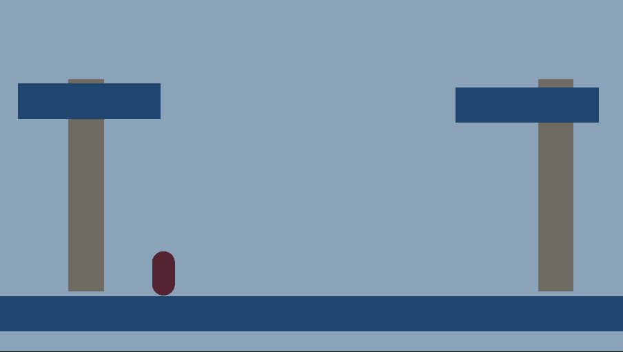

# Journal 1 - Game Analysis
## Ori and the Will of the Wisps
Ori and the Will of the Wisps is a 2D metroidvania platformer created by Moon Studios. You play as Ori, a forest spirit, who embarks on a journey to save the forest of Niwen. This game has several interesting mechanics which I find especially inspiring. 

### Bash Ability
The core idea of a metroidvania is the player needing to progress, earn a new ability, and tackle previously explored areas with that new ability to get to previously unreachable places, and so on. Often, these games fall into the trap of single abilities being only useful in one specific context, for instance, a red ability unlocks the red door. Bash, on the other hand, manages to recontextualize the entire game. The Bash ability allows Ori to use certain in-game props to propel themselves in a chosen, aimed direction. There are several bash-able objects in the game, but most notably, Ori can bash off of enemies. This completely alters how the player moves through the world. For instance, areas ridden with dangerous flying enemies are suddenly areas with infinite upward movement for Ori and difficult enemies and projectiles can be bashed at one another. 

### Burrow Ability
The Burrow ability allows Ori to enter a high-speed burrowing state when they enter sandy areas. The strength of this ability lies in how varied its uses are depending on where you are in the environment. You can dig through the sand on the ground, or dig-dash through suspended sand boulders and disappearing sandy platforms. Even though this ability does somewhat have the problem of only being relevant in the desert area, I still think it’s a masterful example because of just how well it integrates itself into Ori’s moveset.

### Where have the designers failed?
I have loved almost everything except Ori and the Will of the Wisps, except one area: the Mouldwood Depths. This area is submerged in dangerous darkness that requires the player to carefully navigate between the few light points in the area. In a game centred around fluid, fast-paced platforming, this slow and careful area feels counter-intuitive. Suddenly the tricks the player has been learning to improve their navigation throughout the world of Ori are completely useless as the unforgiving environment forces the pace to slow to a crawl. 

### Techniques that could be used in personal projects?
I feel especially inspired by how Ori uses the actions the player can take as verbs. Ori doesn’t add new buttons for every new ability the player has. Instead, new abilities get integrated seamlessly into the moveset based on the overarching verb that move falls under. For instance, the underwater dash and burrow both use the same key as the early game Dash ability, since all three involve a burst of speed, the only difference being what environment Ori is in. Similarly, the bash and the grapple abilities both use the same controls. These design decisions help the gameplay feel fluid and not clunky. I feel inspired to take this approach when designing player movesets, as opposed to simply bloating the game with more complex controls that don’t feel natural.

# Journal 2 - Conceptualizing

## Idea #1: Plant reviving and withering

### Problem statement
How can I make a game where you take your magic from your environment, instead of having innate abilities?

### Idea
The player has the ability to sap the life force of plants around them, store the magic, and throw it back out to revive other plants. Plants “activate” when they are revived, for instance, a vine becomes climbable. Therefore, the challenge would be activating and deactivating the right plants to be able to make it to the exit. 

### Design values
Decision making: The player would be deciding which plants to revive and which plants to kill by observing their environment carefully. The player would therefore be developing the skill of deductive reasoning, working backwards from their end goal to figure out how to reach it.

Experience: The player gets to control the environment around them and manipulate it to their liking. They would feel satisfaction when they select the correct plants to revive and they are rewarded with safe passage to their destination.

## Idea #2: Piecing together an illustrated journal/storybook which has gotten partially destroyed

### Problem statement
How can I make a game that combines Tunic and Return of the Obra Dinn?

### Idea
The player can flip through the pages of the journal which they do have. They can “enter” the images to see fragments of scenes, but the pages are out of order. As they play the game, the player may find snippets of text or pictures which they can place in order as they try to piece together the story. When the player has a certain amount of correct information, the game will confirm it. 

### Design Values

Challenge: This game would challenge how the player experiences a narrative as, unlike a traditional narrative game, this game’s narrative would be discovered and pieced together anachronistically.

Theme: Maybe the player is piecing together the narrative of someone important to them like their S/O, or a close friend, and they discover they didn’t know them at all. 

## Idea #3: A game illustrating the struggles of anxiety, with fantasy elements

### Problem statement
How can I make a game that comments on mental health, similar to Gris?

### Idea
The player must balance their anxiety metre as they switch between the calm world and the nightmare world in their mind, solving puzzles using elements from both worlds while being careful not to overstress themselves.

### Design Values

Experience: The player would need to do certain actions to minimise or purposefully increase their stress depending on the current puzzle they are trying to solve. The player should experience stress and calmness along with their character, mimicking the struggle of anxiety.

Themes: Throughout the game the player would come to terms with their anxiety, and maybe even their ability to function well under stress at times (like hyperfixations and adrenaline in neurodivergent people), and embrace it as part of themselves.

# Journal 3 - First Explorative Prototype
For my first prototype, I explored the mechanic of killing and reviving plants in the environment to solve navigation puzzles. This prototype was mostly implementation-focused: I was testing to see if I could feasibly code the mechanic in mind. This was my first time ever coding platformer-style physics, so I had to test implementation first before I could think about look-and-feel or role.

## Prototype Showcase
The player spawns in an environment with one dead vine, and one living vine. The player is trying to reach the upper platform on the left.The living vine is climbable, and the dead one is not. The player has no Magic right now, so they cannot shoot anything, either.

The player uses right click to vaccuum all living plants' energy within its vicinity. Both plants are now dead.

The player has gained some Magic now, which they can use to shoot life force into the plant which will lead them to their goal.

The plant on the right is now alive. 

The player climbs up, and reaches their goal!

You can download the prototype [here!](https://github.com/alissia18/CART315/tree/main/Games/ExplorativePrototypes)

## Challenges
The most difficult part of making this prototype was figuring out how to let the player climb a vine while making it impossible for them to accidentally fall off. I needed to add two colliders on it, one to check whether the player is climbing it and one to react to Magic that is shot at it. Figuring out the initial physics controls was also difficult, but I feel it will be much easier next time I have to make a platformer-style prototype because I have a base script to work from.

## Outcomes
I was very happy at the end of this exercise because I did achieve my goal! I was able to implement the mechanic successfully. If I were to take this idea further I would prototype look and feel, and maybe come up with some other plants with different effects. I am excited to create more prototypes in Unity!

